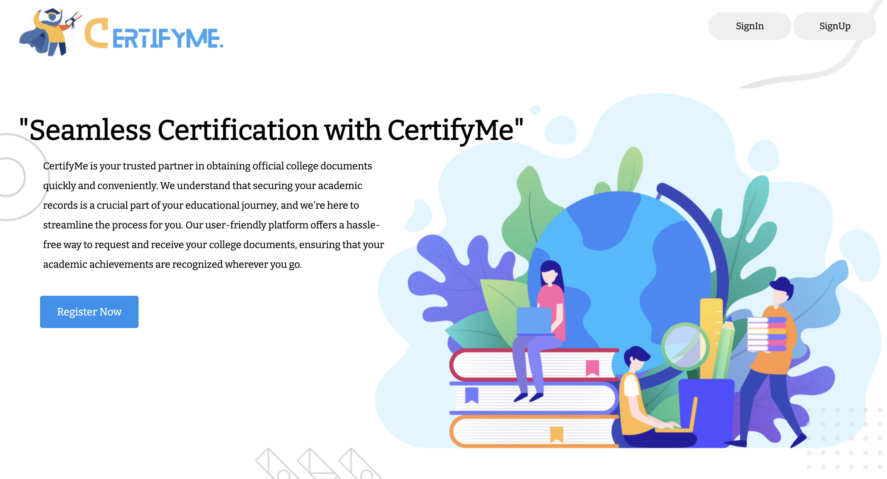
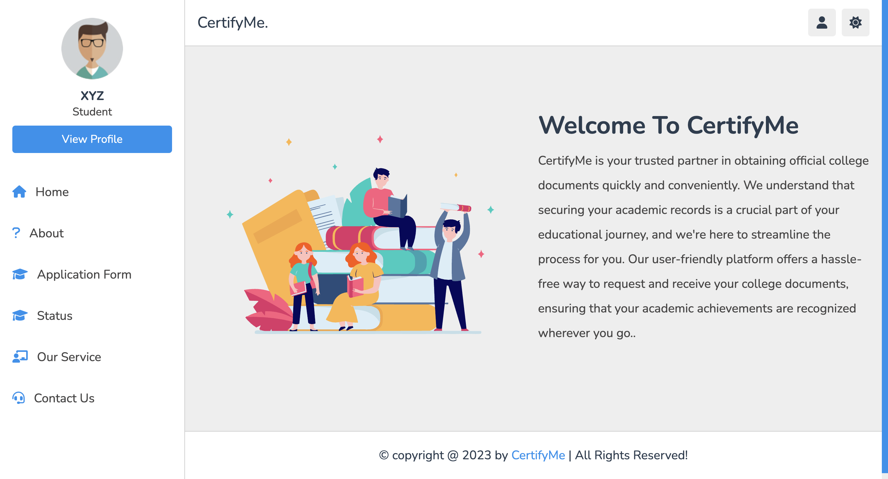

# 🌟 CertifyMe: Empowering Education Through Seamless Certification 🌟


## 📖 Introduction
CertifyMe is an innovative web-based platform designed to streamline the certification process for students, administrators, and faculty members. It aims to simplify various tasks, from document submission to academic query management, enhancing the overall user experience.

## ✨ Features
- 🔒 **User Registration and Secure Login**
- 📄 **Document Submission System**
- 📝 **Query Management System**
- 🖥️ **Administrative Dashboard**
- 🧩 **Examination and Academic Management**

## 🛠️ Technologies Used
- **Frontend:** HTML, CSS, JavaScript
- **Backend:** PHP
- **Database:** MySQL

## 🚀 Getting Started
Follow these instructions to set up the project on your local machine.

### Prerequisites
- [XAMPP](https://www.apachefriends.org/index.html) or any other web server with PHP and MySQL

### Installation
1. Clone the repository:
   ```bash
   git clone https://github.com/yourusername/CertifyMe-Project.git

## 📸 Screenshots




## 📫 Contact

Vineet Vinod Singh -[Vineet's LinkedIn](https://www.linkedin.com/in/vineet-vinod-singh/)

